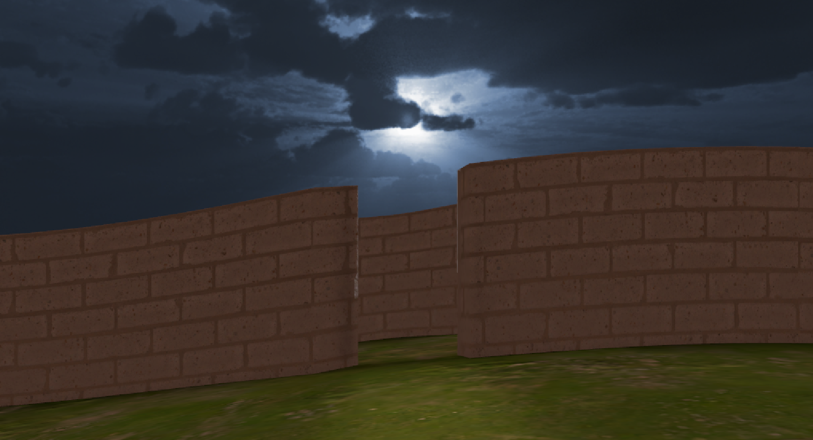
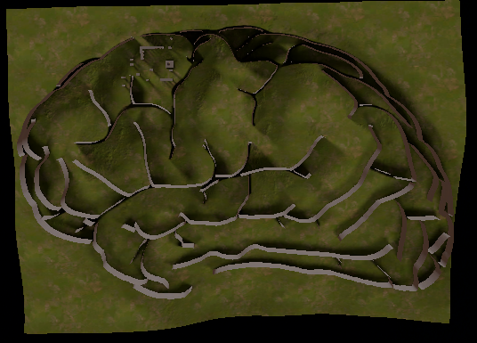
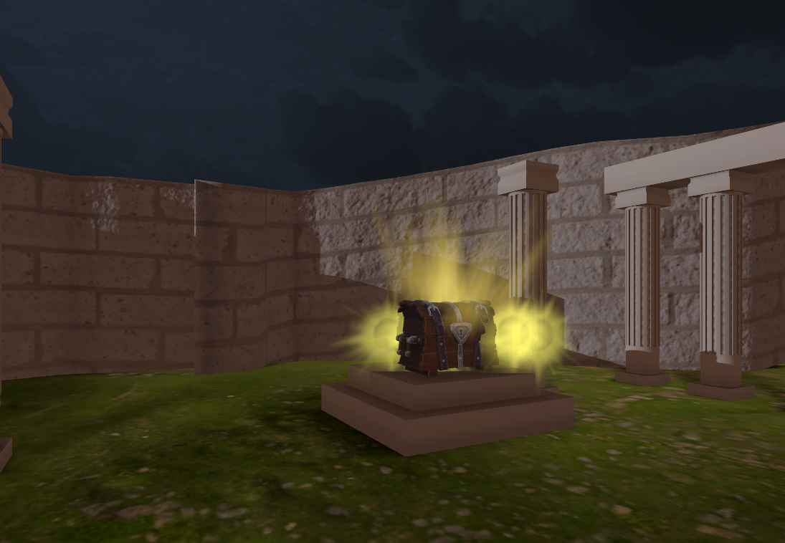
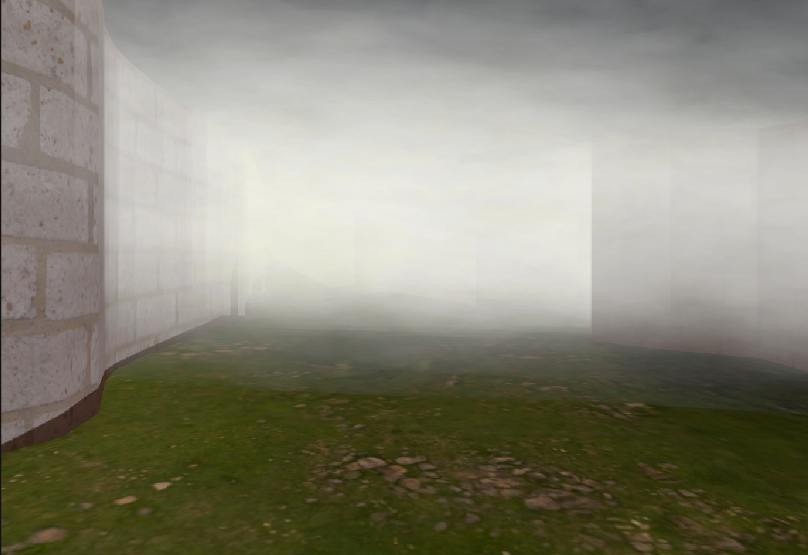
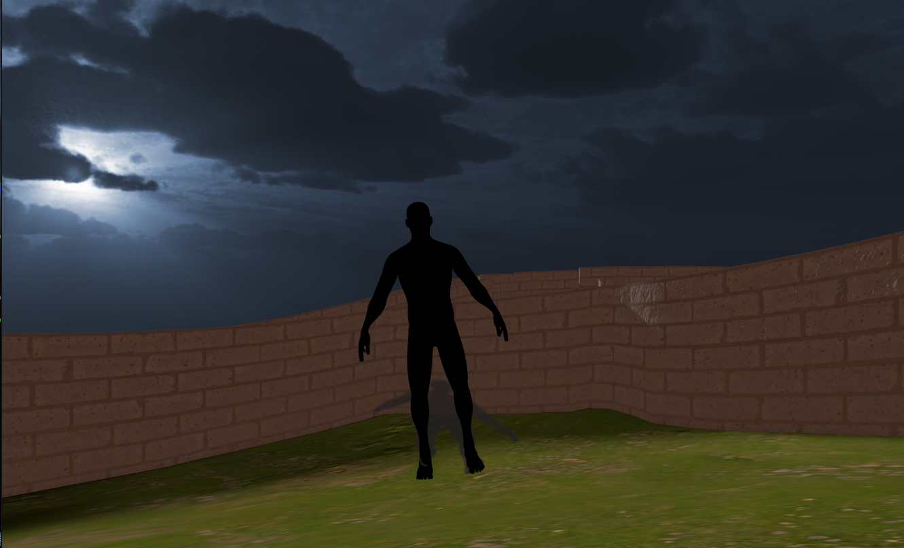
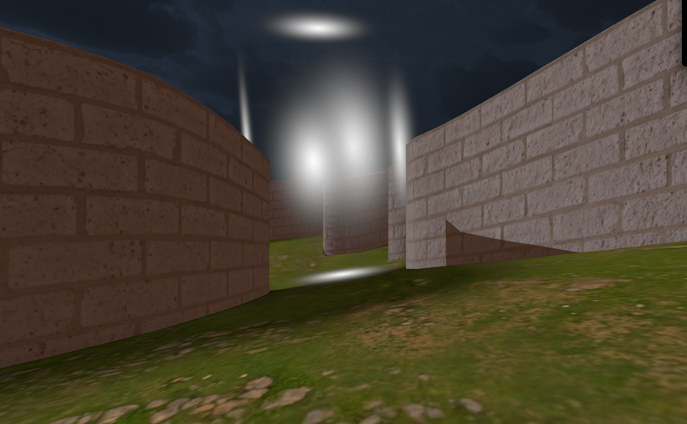

# Il Labirinto di Brodmann

## Descrizione

"Il Labirinto di Brodmann" è un'esperienza immersiva di tipo *puzzle horror* sviluppata per la piattaforma di realtà virtuale Meta Quest 2. L'utente si ritrova intrappolato in un labirinto surreale che ha le sembianze di un cervello umano e deve trovare la via d'uscita.

Questo progetto nasce con l'obiettivo di analizzare e definire una pipeline di sviluppo efficiente e ottimizzata per applicazioni VR su hardware mobile. L'intero workflow è basato sull'integrazione di tre strumenti chiave: **Blender** per la modellazione 3D, **Unity** come motore di gioco e l'ecosistema **Meta XR** per lo sviluppo e il testing in tempo reale.

L'applicazione sfrutta appieno il potenziale immersivo della VR per creare un'esperienza di gioco intensa, ottimizzata per le limitazioni hardware del visore e progettata per prevenire la cinetosi.

## Concept del Gioco

L'utente è intrappolato in un labirinto a forma di cervello e l'obiettivo è trovare una via d'uscita. La conformazione delle aree e il posizionamento degli eventi sono stati studiati per rispecchiare specifiche funzioni cognitive, rendendo l'esperienza non solo spaventosa, ma anche concettualmente coerente.

*   **Paura e ansia**: Associate all'area che rappresenta l'amigdala.
*   **Disorientamento**: Posizionato nelle zone che richiamano il lobo parietale.

La realtà virtuale è fondamentale per l'efficacia del concept, amplificando la sensazione di claustrofobia e l'impatto degli elementi horror.

  

## Caratteristiche Tecniche

### Workflow di Sviluppo
Il progetto segue una pipeline ottimizzata per garantire performance elevate su Meta Quest 2:
1.  **Modellazione 3D (Blender)**: Creazione di asset *low-poly* per ridurre il carico computazionale.
2.  **Texturing e Baking (Blender)**: Utilizzo di tecniche di *baking* per "cuocere" l'illuminazione e i dettagli sulle texture. Questo permette di usare materiali `Unlit` in Unity, abbattendo i costi di rendering in tempo reale.
3.  **Assemblaggio e Logica (Unity)**:
    *   Utilizzo della **Universal Render Pipeline (URP)**, ottimizzata per la grafica su piattaforme multiple e per il rendering VR.
    *   Integrazione dei **Meta XR SDK** (Core, Interaction e Audio) per gestire il tracking, le interazioni e l'audio spaziale.
4.  **Testing e Deploy**:
    *   **Meta Quest Link** per la prototipazione rapida e il test in tempo reale dall'editor.
    *   **Meta Quest Developer Hub (MQDH)** per il deploy delle build `.apk` e il monitoraggio delle performance direttamente sul visore.

### Ottimizzazioni Implementate
*   **Modellazione Low-Poly**: Mantenimento di un basso numero di poligoni per ogni modello.
*   **Texture Baking**: L'illuminazione globale, le ombre e i dettagli vengono pre-calcolati e salvati in un'unica texture map, riducendo drasticamente il carico sulla GPU.
*   **Level of Detail (LOD)**: La complessità degli oggetti viene ridotta dinamicamente in base alla loro distanza dalla telecamera.
*   **Materiali URP Ottimizzati**: Utilizzo di materiali `Unlit` e `Lit` della URP, disabilitando le feature grafiche più onerose.

## Funzionalità VR

L'esperienza è stata costruita attorno alle meccaniche della VR per massimizzare l'immersione.

### Navigazione
Per ridurre il rischio di *motion sickness*, sono state implementate due modalità di locomozione:
*   **Teletrasporto**: Permette di spostarsi istantaneamente puntando una destinazione. È la soluzione più confortevole per prevenire la cinetosi.
*   **Movimento Continuo (Smooth Locomotion)**: Offre un'esperienza più fluida e immersiva, gestita tramite lo stick analogico dei controller.

### Interazione
L'utente può interagire con l'ambiente circostante in due modi:
*   **Interazione diretta**: Afferrando e manipolando oggetti vicini.
*   **Interazione a raggio**: Utilizzando un raggio proiettato dal controller per attivare oggetti a distanza, come l'apertura di un forziere.

## Elementi di Gioco

*   **Labirinti Emisferici**: La scena è divisa in due labirinti che rappresentano l'emisfero destro e sinistro del cervello.
*   **Portale di Teletrasporto**: Un portale permette al giocatore di spostarsi tra i due emisferi, rispecchiando la connettività cerebrale.
*   **Eventi Trigger**: Il passaggio del giocatore in aree invisibili attiva eventi scriptati come suoni ambisonici, apparizioni di ombre e l'attivazione di sistemi di particelle (es. nebbia).

|  |  |  |
| :---: | :---: | :---: |
| Nebbia volumetrica per ostacolare la vista. | Un'ombra appare per spaventare il giocatore. | Portale per il passaggio tra emisferi. |

## Sviluppi Futuri

Il prossimo passo cruciale è la compilazione della build finale (`.apk`) e la sua installazione come applicazione *standalone* sul Meta Quest 2 tramite il MQDH. Questo permetterà di:

*   Valutare le performance reali dell'applicazione in un ambiente nativo.
*   Monitorare metriche come FPS e utilizzo di CPU/GPU senza l'ausilio del PC.
*   Validare l'efficacia dell'intera pipeline di sviluppo ottimizzata.

## Autore

*   **Federica Di Giaimo**
